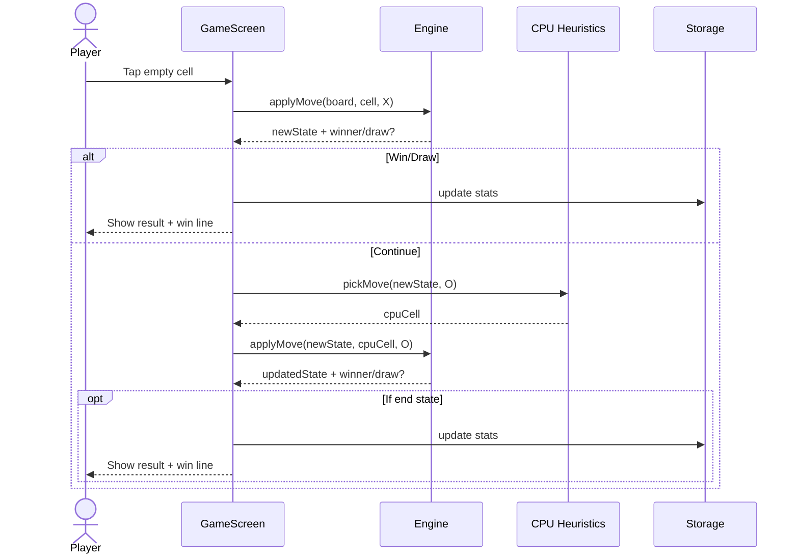

# XO Architecture Document

## 0. Overview
This document defines the architecture for XO, a mobile-only tic‑tac‑toe game built with Expo + React Native + TypeScript. It aligns with the approved PRD and locks core technical decisions for development and testing. The Tech Stack section is the single source of truth for technology choices and versions for this project (definitive table referenced by all other docs) .

## 1. High-Level Architecture
- Style: Mobile monolith (Expo-managed) with no runtime backend in MVP.
- Repository: Monorepo with mobile/ and backend/ folders (backend unused in MVP; future-ready scaffold).
- Data: Device-local persistence for stats/settings via AsyncStorage.
- State: Local React state + hooks; pure functions for game engine.
- Accessibility: WCAG AA targets (contrast, touch targets, focus order) per PRD.

### 1.1 System Diagram
```mermaid
graph TD
  U[User] -->|Tap| App[XO Mobile App (Expo, RN)]
  subgraph Device
    App --> UI[UI Layer: Screens + Components]
    App --> Engine[Game Engine (pure TS)]
    App --> AI[CPU Heuristics]
    App --> Store[AsyncStorage Wrapper]
  end
  style App fill:#1f78b4,stroke:#0b3551,stroke-width:1
  style Engine fill:#a6cee3,stroke:#0b3551
  style AI fill:#a6cee3,stroke:#0b3551
  style Store fill:#a6cee3,stroke:#0b3551
  style UI fill:#a6cee3,stroke:#0b3551
```

### 1.2 Architectural Patterns
- Pure-logic core: Rules engine as framework-agnostic functions to maximize testability and reuse.
- Presentation decomposition: Board/Cell/HUD as small, memoized components.
- Facade wrapper for storage: Single module abstracts AsyncStorage access and key schema.
- Navigation: Simple stack navigation for Home → Game → Settings (kept minimal).

## 2. Tech Stack (Definitive)
The following versions are aligned with the provided template and Expo SDK 54. Pin exact versions during setup to avoid drift. This table is authoritative for development and testing decisions .

| Category | Technology | Version | Purpose | Rationale |
|---|---|---:|---|---|
| Platform | Expo | ~54.0.23 | Managed app runtime | Matches template; fast iteration
| Framework | React Native | 0.81.5 | Mobile UI | Current with Expo 54
| UI Library | React | 19.1.0 | Component model | Matches template
| Language | TypeScript | ~5.9.x | Types + tooling | Good RN/Expo support
| Navigation | @react-navigation/native | 7.x (pin at setup) | Screen flow | De facto RN navigation
| Storage | @react-native-async-storage/async-storage | 1.23.x (pin at setup) | Local stats/settings | Lightweight key-value
| Haptics | expo-haptics | SDK 54 | Feedback | Quick, optional polish
| Sound | expo-av | SDK 54 | Audio cues | Lightweight sounds
| Testing (unit) | jest + ts-jest | 29.x | Game engine tests | Standard RN testing
| Testing (integration) | @testing-library/react-native | 13.x | UI flow smoke | Validates core flows

Note: Exact pins for navigation/storage/testing libs will be finalized against Expo SDK 54 compatibility during dependency install; the PRD requires Unit + Integration testing coverage.

## 3. Components
- Game Engine (core/engine)
  - Responsibility: Board state, legal moves, win/draw detection, turn switching.
  - Interfaces: `createGame()`, `applyMove()`, `getWinner()`, `isDraw()`.
  - Dependencies: None (pure TS).
- CPU Heuristics (core/ai)
  - Responsibility: Simple opponent moves (win/block + basic center/corner heuristics).
  - Interfaces: `pickMove(board, player)`.
  - Dependencies: Game Engine types.
- AsyncStorage Wrapper (services/storage)
  - Responsibility: Persist stats and settings; expose typed API.
  - Interfaces: `getStats()`, `saveStats()`, `getSettings()`, `saveSettings()`, `resetAll()`.
  - Dependencies: AsyncStorage.
- UI Components (ui/components)
  - Responsibility: `Board`, `Cell`, `HUD` (turn indicator, restart), `WinLine`.
  - Dependencies: Engine state, theme/tokens.
- Screens (ui/screens)
  - Home: Mode selection (Solo, Pass‑and‑Play); quick actions.
  - Game: Board, HUD, end‑state dialog; integrates engine and AI.
  - Settings: Sound/haptics toggles; reset stats; credits.

## 4. Core Workflows (Sequence)
- Solo vs CPU turn


## 5. Data and Persistence
- Keys: `xo:stats:{mode}`, `xo:settings`.
- Stats model: `{ wins: number, losses: number, draws: number }` per mode.
- Settings model: `{ soundEnabled: boolean, hapticsEnabled: boolean }`.
- Atomic updates: read‑modify‑write with simple collision avoidance; small data footprint.

## 6. Accessibility & UX Standards
- WCAG AA basics: contrast, 44dp min touch targets, focus order where applicable; support reduced motion.
- Haptics/sound optional and toggleable.

## 7. Performance & Reliability
- 60fps target; avoid unnecessary re-renders via memoization and stable props.
- CPU move selection under ~200ms typical.
- Defensive guards: never overwrite occupied cells; graceful handling of storage failures (retry/backoff minimal, defaults if read fails).

## 8. Testing Strategy
- Scope per PRD: Unit + Integration tests for core logic and key UI flows.
- Unit tests (Jest): engine functions for all win/draw paths; AI move selection sanity.
- Integration tests (Testing Library RN): happy path for Solo and Pass‑and‑Play; restart flow; settings toggles; stats updates.
- Manual smoke on a small matrix (iOS/Android phones) before release.

## 9. Source Tree (Authoritative Guide)
```
project-root/
├── mobile/
│  ├── src/
│  │  ├── core/
│  │  │  ├── engine/            # Pure TS rules engine
│  │  │  └── ai/                 # CPU heuristics
│  │  ├── services/
│  │  │  └── storage/            # AsyncStorage wrapper
│  │  ├── ui/
│  │  │  ├── components/         # Board, Cell, HUD, WinLine
│  │  │  └── screens/            # Home, Game, Settings
│  │  ├── navigation/            # Minimal stack navigator
│  │  ├── theme/                 # Color tokens, spacing, motion
│  │  ├── lib/                   # Small utilities/types
│  │  └── tests/                 # Unit + integration tests
│  └── App.tsx
└── backend/                     # Scaffold only (unused in MVP)
```
- This tree guides where new files live and how modules are named; stories must align to this structure for predictable implementation and review .

## 10. Security & Privacy (Mobile)
- No PII; only local, non-sensitive stats/settings.
- Avoid logging user interactions; no analytics in MVP.
- Keep secrets out of source; none expected for MVP.

## 11. Infrastructure & Delivery
- CI: Optional lightweight CI for build + tests.
- Distribution: TestFlight (iOS) and Internal Testing (Play) prior to 1.0.
- Rollback: Ship small builds; revert to previous build if a critical regression is found.

## 12. Next Steps
- Product Owner validation of this architecture, then proceed with development prep: shard this document and the PRD into docs/architecture/ and docs/prd/ to enable story creation and focused dev cycles . After approval, we will shard the docs and generate comprehensive stories for all PRD epics.

References: The Tech Stack section is definitive and should be approved before sharding; subsequent story creation will cite sections of this architecture by heading for precise guidance .
