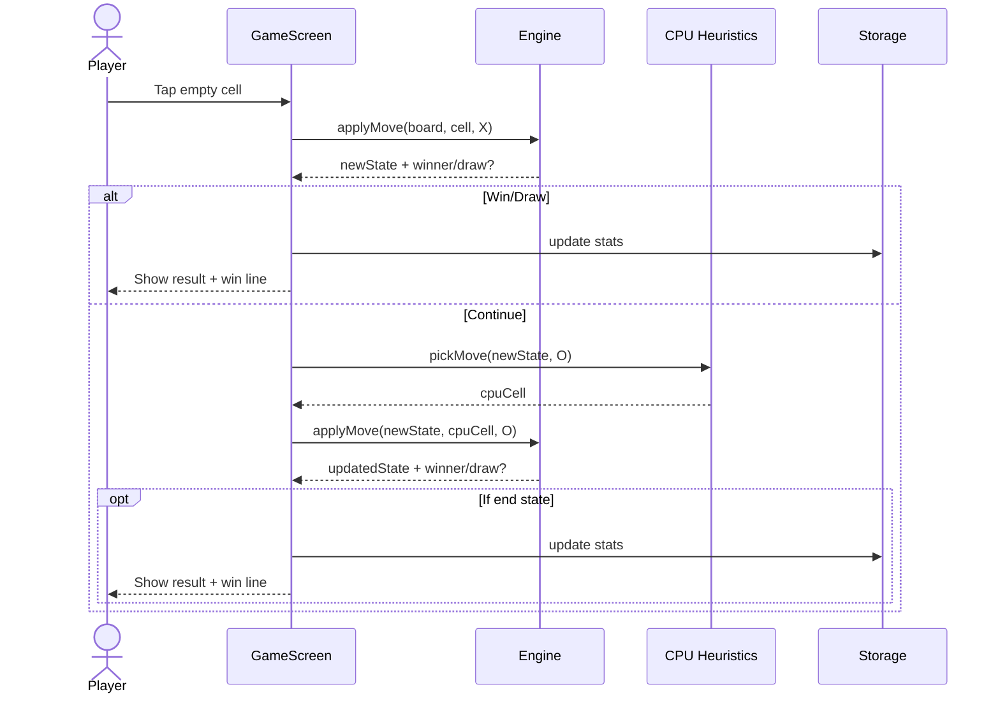

# 4. Core Workflows

## Solo vs CPU turn

```mermaid
sequenceDiagram
  actor P as Player
  participant G as GameScreen
  participant E as Engine
  participant AI as CPU Heuristics
  participant S as Storage
  P->>G: Tap empty cell
  G->>E: applyMove(board, cell, X)
  E-->>G: newState + winner/draw?
  alt Win/Draw
    G->>S: update stats
    G-->>P: Show result + win line
  else Continue
    G->>AI: pickMove(newState, O)
    AI-->>G: cpuCell
    G->>E: applyMove(newState, cpuCell, O)
    E-->>G: updatedState + winner/draw?
    opt If end state
      G->>S: update stats
      G-->>P: Show result + win line
    end
  end
```